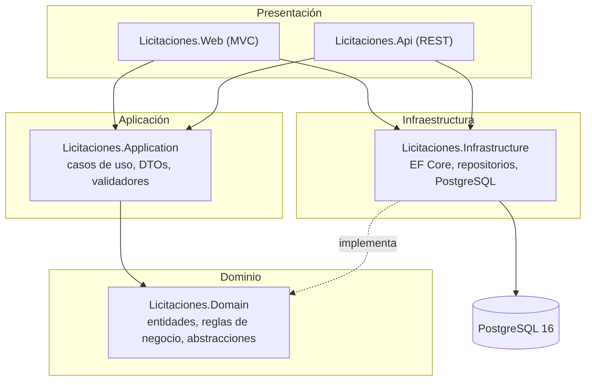

# Arquitectura General

## Estilo arquitectónico

**Monolito modular** en capas (Domain → Application → Infrastructure → Web/Api), según lo permitido por el enunciado (§6.3). No se usan microservicios: el sistema tiene un único límite transaccional claro (la base de datos de licitaciones) y separar en servicios independientes no está justificado técnicamente para este alcance. Sería complejidad especulativa, contraria al principio XP de diseño simple.

La flecha punteada indica **inversión de dependencias**: `Domain` define las interfaces (`ILicitacionRepository`, `IReloj`, etc.) y `Infrastructure` las implementa; ni `Domain` ni `Application` referencian Entity Framework Core o PostgreSQL directamente.

## Responsabilidad por proyecto

| Proyecto | Responsabilidad | Depende de |
| --- | --- | --- |
| `Licitaciones.Domain` | Entidades, reglas de negocio puras, enumeraciones, excepciones de negocio, interfaces de repositorio y de reloj. Sin dependencias externas. | — |
| `Licitaciones.Application` | Casos de uso, DTOs, validadores, orquestación de reglas que requieren más de una entidad o consulta al repositorio. | `Domain` |
| `Licitaciones.Infrastructure` | EF Core, configuraciones de mapeo, migraciones, repositorios, `UnitOfWork`, reloj del sistema, datos semilla. | `Application`, `Domain` |
| `Licitaciones.Web` | Controladores MVC delgados, vistas Razor, landing page, temas, validación visual. | `Infrastructure` |
| `Licitaciones.Api` | Endpoints REST versionados, DTOs de transporte, OpenAPI, `ProblemDetails`. | `Infrastructure` |

`Web` y `Api` referencian `Infrastructure` (no solo `Application`) porque son las raíces de composición: registran la inyección de dependencias (`AddInfrastructure`) que cablea las interfaces de dominio con sus implementaciones concretas.

## Principios aplicados

- **Controladores delgados:** la lógica de negocio vive en el dominio (invariantes de entidad) y en la aplicación (orquestación con repositorios), nunca en un controlador MVC o de API.
- **Inyección de dependencias:** todo componente de infraestructura se resuelve por interfaz (`IProveedorRepository`, `IReloj`, `IUnitOfWork`, …), registrado una sola vez en `ServiceCollectionExtensions.AddInfrastructure`.
- **Reloj inyectable:** ninguna regla de negocio llama `DateTime.Now`/`UtcNow` directamente; todas reciben `IReloj`, lo que permite pruebas deterministas (`RelojFalso`) y un `RelojSistema` real en producción.
- **Errores controlados:** las reglas de negocio lanzan `ReglaNegocioException` (con `Codigo` y `TipoErrorNegocio`); las violaciones de integridad de PostgreSQL se traducen en `UnitOfWork` antes de llegar a Web/Api, que nunca ven una `PostgresException` cruda.

## Documentos relacionados

- [modelo-datos.md](modelo-datos.md): modelo entidad-relación y convenciones de columnas.
- [integracion-modulos.md](integracion-modulos.md): cómo cooperan los módulos en los flujos de extremo a extremo.
- [Modulos/persistencia.md](Modulos/persistencia.md), con el detalle de la capa de infraestructura.
