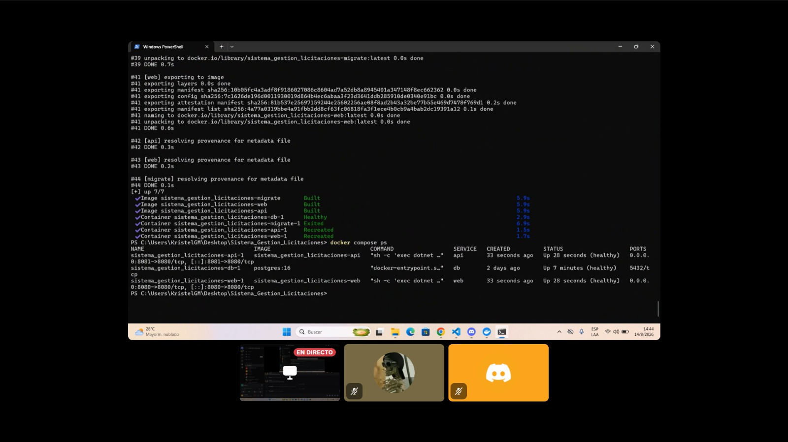
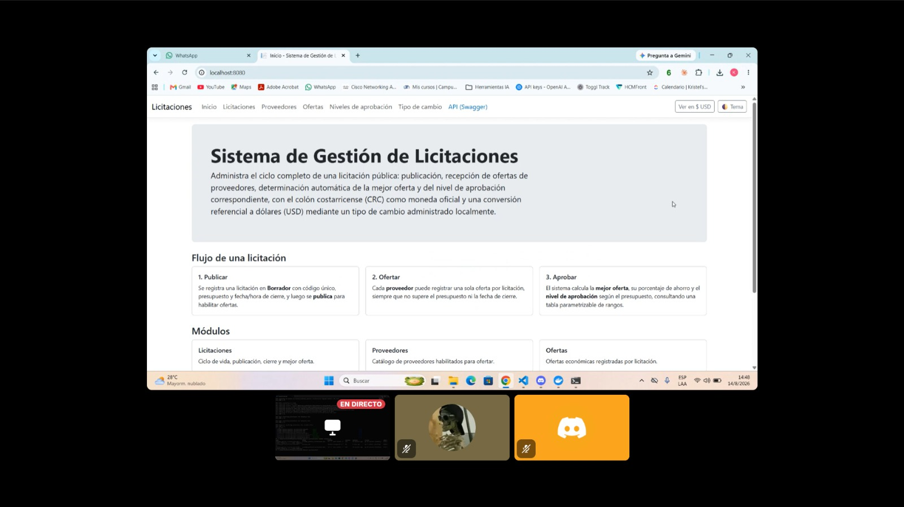
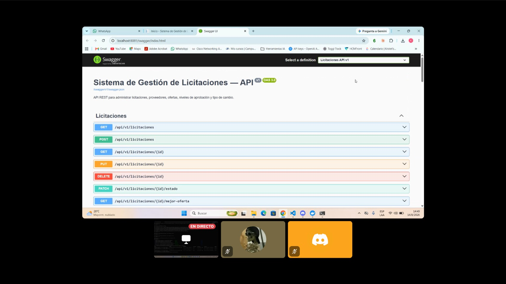
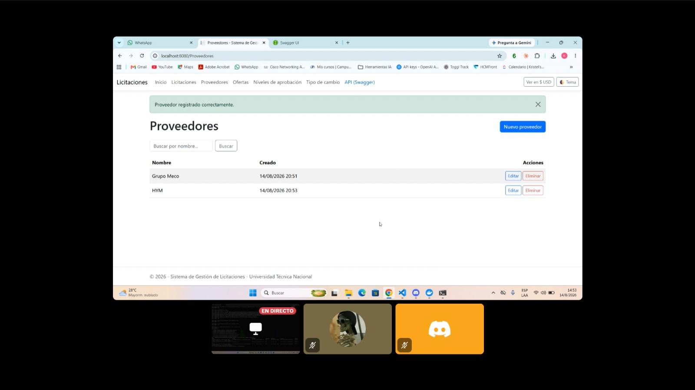
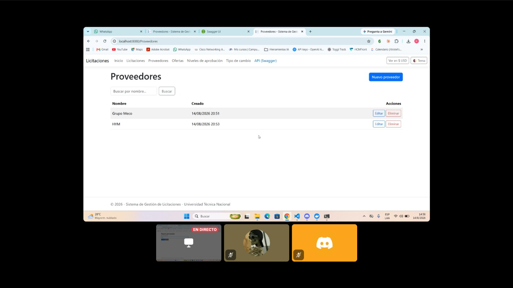

# Docker

## Arquitectura de contenedores

`docker-compose.yml` define cuatro servicios:

| Servicio | Rol | Puerto publicado |
| --- | --- | --- |
| `db` | PostgreSQL 16, con volumen y healthcheck | — (solo red interna de Compose) |
| `migrate` | Aplica las migraciones de EF Core una sola vez y termina (`Licitaciones.Migrator`) | — |
| `web` | Interfaz MVC (landing, CRUD, toggle CRC/USD) | `8080` |
| `api` | API REST + Swagger | `8081` |

`web` y `api` esperan a que `migrate` termine con éxito (`condition: service_completed_successfully`) antes de arrancar, y `migrate` espera a que `db` esté saludable (`condition: service_healthy`). Así las migraciones se ejecutan de forma controlada y separada del arranque de la aplicación (spec §13.2), no implícitamente en cada inicio.

## `Dockerfile`

Un único `Dockerfile` multi-stage en la raíz sirve para los tres ejecutables (`Licitaciones.Web`, `Licitaciones.Api`, `Licitaciones.Migrator`), seleccionados con `--build-arg PROJECT=<nombre>` (ver `docker-compose.yml`), en vez de mantener tres Dockerfiles casi idénticos:

1. **Etapa `build`** (`dotnet/sdk:9.0`): copia primero los `.csproj` para aprovechar la caché de capas, restaura, copia el resto de `src/` y publica en modo `Release`.
2. **Etapa `runtime`** (`dotnet/aspnet:9.0`): copia solo el resultado de la publicación, instala `curl` (usado por los healthcheck), crea un usuario no privilegiado (`appuser`, uid 5678) y ejecuta como ese usuario.

## Cómo levantar el proyecto

```bash
docker compose up --build
```

- Web: http://localhost:8080
- API + Swagger: http://localhost:8081/swagger

## Variables de entorno

| Variable | Servicio(s) | Descripción |
| --- | --- | --- |
| `POSTGRES_PASSWORD` | `db`, `migrate`, `web`, `api` | Contraseña de PostgreSQL; por defecto `licitaciones_local` (solo para desarrollo local, no es un secreto real). |
| `ConnectionStrings__LicitacionesDb` | `migrate`, `web`, `api` | Cadena de conexión completa; se arma automáticamente en `docker-compose.yml` a partir de `POSTGRES_PASSWORD`. |
| `ApiBaseUrl` | `web` | URL pública de la API, usada para el enlace a Swagger en la interfaz. |

No se versionan credenciales reales: `POSTGRES_PASSWORD` tiene un valor de desarrollo por defecto y puede sobreescribirse con un archivo `.env` (no incluido en el repositorio).

## Verificación realizada en esta iteración

Ejecutado en esta máquina, no solo documentado:

1. `docker compose build`: las tres imágenes (`web`, `api`, `migrate`) se construyeron sin errores.
2. `docker compose up -d`: los cuatro contenedores llegaron a estado `healthy`/`Exited (0)` (este último para `migrate`, que es un job de un solo uso).

   

3. Verificación funcional por `curl`: `GET /` (Web, `200`), `GET /Proveedores` (Web, `200`), `GET /swagger/v1/swagger.json` (Api, `200`), `GET /api/v1/niveles-aprobacion` (datos semilla presentes), `POST /api/v1/proveedores` (`201`).

   
   

4. **Persistencia real:** se creó un proveedor vía la interfaz Web, se ejecutó `docker compose down` (sin `-v`) y `docker compose up -d` de nuevo, y el proveedor seguía presente. Esto confirma que el volumen `licitaciones-db-data` persiste los datos entre reinicios de contenedores (spec §13.1: "Persistencia demostrable después de reiniciar contenedores").

   
   
