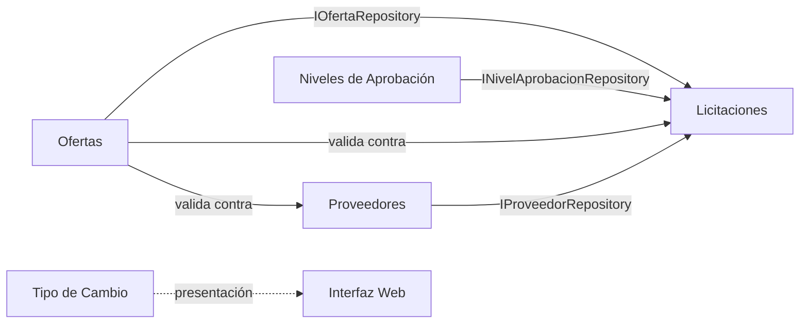
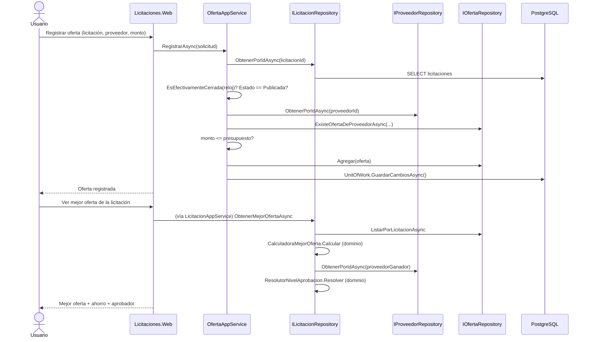

# Integración entre Módulos

## Cómo cooperan los módulos

Los cinco módulos funcionales (Proveedores, Licitaciones, Ofertas, Niveles de Aprobación, Tipo de Cambio) son verticales independientes en `Licitaciones.Application`, cada uno con su propio servicio de aplicación, pero **Licitaciones es el punto de integración**: su servicio (`LicitacionAppService`) depende de los repositorios de Ofertas, Niveles de Aprobación y Proveedores para resolver la mejor oferta con el nombre del proveedor y el aprobador en una sola consulta (`ObtenerMejorOfertaAsync`). Ningún otro módulo depende de Licitaciones a nivel de aplicación: la dependencia es unidireccional, lo que evita ciclos.

La flecha punteada indica que Tipo de Cambio no participa en ninguna regla de negocio de los otros módulos: es puramente una capa de presentación (conversión CRC→USD para mostrar, nunca para almacenar ni para validar presupuestos).

## Flujo de extremo a extremo: de la oferta a la aprobación

## Límites entre componentes

- **Web y Api nunca comparten proceso ni estado**: cada uno resuelve sus propias dependencias vía `AddInfrastructure`/`AddApplication`, pero ambos leen la misma base de datos PostgreSQL. No hay caché ni estado compartido en memoria entre ellos.
- **El dominio no conoce la aplicación ni la infraestructura**: `Licitaciones.Domain` no referencia EF Core, ASP.NET Core ni ningún otro proyecto. Las reglas que cruzan agregados (por ejemplo, "no ofertar si la licitación está cerrada") se resuelven en `Licitaciones.Application`, que orquesta varios repositorios pero sigue sin conocer PostgreSQL directamente (solo las interfaces `I*Repository` definidas en el dominio).
- **Las excepciones son el contrato de error entre capas**: `ReglaNegocioException`/`EntidadNoEncontradaException` viajan desde el dominio o la aplicación hasta Web (capturadas en los controladores MVC) y hasta Api (traducidas a `ProblemDetails` por `ExcepcionesDeNegocioHandler`). Ninguna capa superior necesita conocer PostgreSQL ni Entity Framework Core para manejar un error.
- **El toggle CRC/USD es exclusivo de la interfaz**: no existe una ruta de negocio que dependa de la moneda mostrada; `TipoCambioAppService.ConvertirCrcAUsdAsync` solo se usa para presentación (Web) y para el endpoint `GET /api/v1/tipos-cambio/convertir` de la API.

## Flujo funcional mínimo (§5.3 del enunciado) y su cobertura

| Paso del enunciado | Módulo(s) involucrados | Verificado en |
| --- | --- | --- |
| Landing page y flujo general | Interfaz Web | [interfaz-web.md](Modulos/interfaz-web.md) |
| Modo claro/oscuro | Interfaz Web | [interfaz-web.md](Modulos/interfaz-web.md) |
| Registrar proveedor único | Proveedores | [proveedores.md](Modulos/proveedores.md) |
| Crear y publicar licitación | Licitaciones | [licitaciones.md](Modulos/licitaciones.md) |
| Registrar oferta válida | Ofertas + Licitaciones + Proveedores | [ofertas.md](Modulos/ofertas.md) |
| Rechazar oferta duplicada/sobre presupuesto/vencida | Ofertas + Licitaciones | [ofertas.md](Modulos/ofertas.md) |
| Mejor oferta, clasificación y aprobador | Licitaciones + Ofertas + Niveles de Aprobación + Proveedores | [licitaciones.md](Modulos/licitaciones.md), [niveles-aprobacion.md](Modulos/niveles-aprobacion.md) |
| Alternar CRC/USD | Tipo de Cambio + Interfaz Web | [tipo-cambio.md](Modulos/tipo-cambio.md), [interfaz-web.md](Modulos/interfaz-web.md) |
| Operaciones equivalentes por API REST | Todos | [api.md](api.md) |
