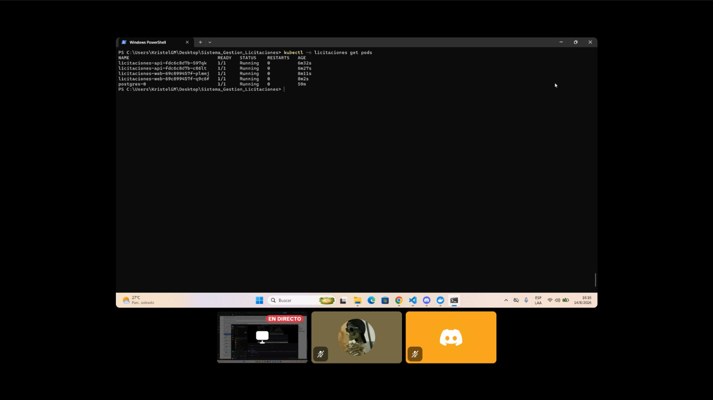
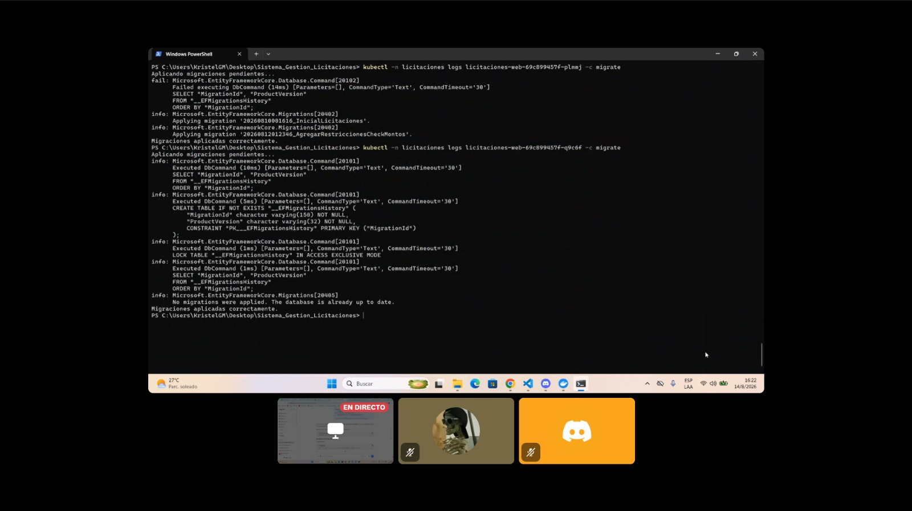
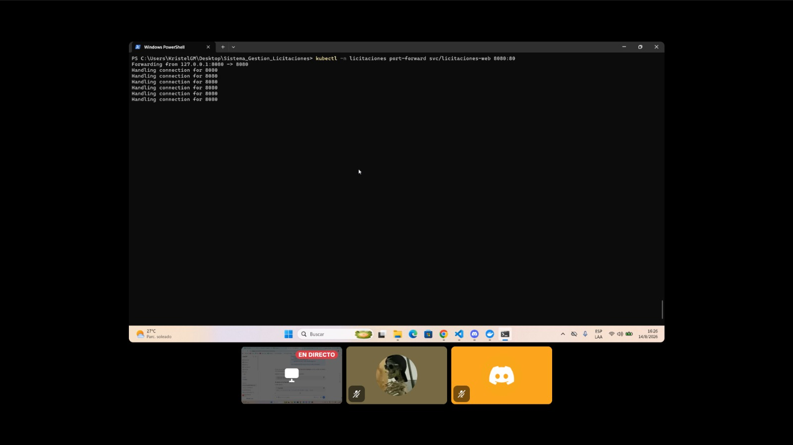
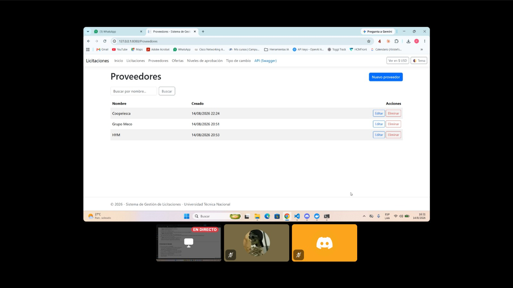

# Kubernetes

## Estado de esta verificación

Los 10 manifiestos se validaron primero contra el esquema real de Kubernetes y, en una sesión posterior del equipo (14 de agosto de 2026, con un clúster local de `kind`), se completó además el **despliegue en vivo** descrito en "Cómo desplegar" más abajo, con pods reales corriendo.

- **Validación de esquema real** con [`kubeconform`](https://github.com/yannh/kubeconform) (`docker run ghcr.io/yannh/kubeconform`) contra el esquema OpenAPI oficial de Kubernetes 1.29: los 10 manifiestos son válidos (`Summary: 10 resources found in 10 files - Valid: 10, Invalid: 0, Errors: 0, Skipped: 0`). Esto verifica estructura, tipos y campos requeridos de cada recurso, no solo que el YAML "parsea".
- `kubectl apply --dry-run=client` (v1.34.1) no pudo completarse porque esa versión requiere contactar un clúster real incluso en modo "client" para el discovery de la API. Se documenta como limitación conocida del cliente instalado, no como validación omitida (`kubeconform` la reemplaza con una verificación más fuerte, ya que valida contra el esquema completo).
- Las tres imágenes referenciadas (`licitaciones-web:latest`, `licitaciones-api:latest`, `licitaciones-migrator:latest`) se construyeron exitosamente con los nombres exactos usados en los manifiestos, con el mismo `Dockerfile` ya verificado en [docker.md](docker.md), y se cargaron al clúster de `kind` con `kind load docker-image`.
- **Despliegue real en `kind`:** los 10 manifiestos aplicados en orden, con todos los pods en `Running`/`Ready` (`postgres-0`, `licitaciones-web-*` ×2, `licitaciones-api-*` ×2), servicios y PVC (`postgres-data`) en `Bound`, y los logs del `initContainer` de migración confirmando que las migraciones se aplicaron antes de servir tráfico. Evidencia y comandos exactos en la sección siguiente.

## Manifiestos

| Archivo | Recurso | Propósito |
| --- | --- | --- |
| `namespace.yaml` | Namespace `licitaciones` | Aísla todos los recursos del proyecto |
| `app-configmap.yaml` | ConfigMap `licitaciones-config` | Configuración no sensible (nombre de BD, entorno, URLs) |
| `app-secret.example.yaml` | Secret `licitaciones-secrets` (plantilla) | Contraseña de PostgreSQL y cadena de conexión — **sin credenciales reales**, ver advertencia abajo |
| `postgres-pvc.yaml` | PersistentVolumeClaim `postgres-data` | Almacenamiento persistente de PostgreSQL (2Gi) |
| `postgres-statefulset.yaml` | StatefulSet `postgres` | PostgreSQL 16 con probes de `pg_isready` y `PGDATA` en subdirectorio (evita el conflicto con `lost+found`) |
| `postgres-service.yaml` | Service headless `postgres` | Identidad de red estable para el StatefulSet |
| `app-deployment.yaml` | Deployment `licitaciones-web` (2 réplicas) | Interfaz Web, con `initContainer` de migración y las tres probes (startup/readiness/liveness) |
| `app-service.yaml` | Service `licitaciones-web` | Expone la Web dentro del clúster (puerto 80 → 8080) |
| `api-deployment.yaml` | Deployment `licitaciones-api` (2 réplicas) | API REST — manifiesto adicional, no exigido por el nombre exacto del enunciado pero necesario para un sistema completo |
| `api-service.yaml` | Service `licitaciones-api` | Expone la API dentro del clúster |

## Advertencia sobre `app-secret.example.yaml`

Es una **plantilla**: contiene el placeholder literal `"reemplazar-con-una-contrasena-real"`, no una credencial real. El flujo correcto es:

```bash
cp k8s/app-secret.example.yaml k8s/app-secret.yaml
# editar k8s/app-secret.yaml con una contraseña real
kubectl apply -f k8s/app-secret.yaml
```

`k8s/app-secret.yaml` (sin `.example`) está en `.gitignore` para que nunca se versione con valores reales.

## Cómo desplegar (con un clúster disponible)

```bash
# 1. Construir y publicar las tres imágenes (o cargarlas al clúster local, p.ej. `kind load docker-image`)
docker build --build-arg PROJECT=Licitaciones.Web -t licitaciones-web:latest .
docker build --build-arg PROJECT=Licitaciones.Api -t licitaciones-api:latest .
docker build --build-arg PROJECT=Licitaciones.Migrator -t licitaciones-migrator:latest .

# 2. Namespace y configuración
kubectl apply -f k8s/namespace.yaml
kubectl apply -f k8s/app-configmap.yaml
kubectl apply -f k8s/app-secret.yaml   # copiado y editado a partir de app-secret.example.yaml

# 3. PostgreSQL
kubectl apply -f k8s/postgres-pvc.yaml
kubectl apply -f k8s/postgres-service.yaml
kubectl apply -f k8s/postgres-statefulset.yaml
kubectl -n licitaciones rollout status statefulset/postgres

# 4. Aplicación (el initContainer "migrate" aplica las migraciones antes de que el pod quede Ready)
kubectl apply -f k8s/app-deployment.yaml
kubectl apply -f k8s/app-service.yaml
kubectl apply -f k8s/api-deployment.yaml
kubectl apply -f k8s/api-service.yaml
kubectl -n licitaciones rollout status deployment/licitaciones-web
kubectl -n licitaciones rollout status deployment/licitaciones-api

# 5. Acceso local
kubectl -n licitaciones port-forward svc/licitaciones-web 8080:80
kubectl -n licitaciones port-forward svc/licitaciones-api 8081:80
```

## Evidencia del despliegue real (§13.2/§17.2)

Capturada en el clúster local de `kind` el 14 de agosto de 2026:

- **Pods:** `kubectl -n licitaciones get pods`, en estado `Running`/`Ready` (`postgres-0`, `licitaciones-web-*` ×2, `licitaciones-api-*` ×2).

  

- **Servicios:** `kubectl -n licitaciones get svc`.

  

- **PVC:** `kubectl -n licitaciones get pvc`, con `postgres-data` en estado `Bound`.

  

- **Logs del initContainer de migración:** `kubectl -n licitaciones logs <pod> -c migrate`.

  

- **Conservación de datos tras reinicio:** se creó un proveedor vía la Web con acceso por `port-forward`, se ejecutó `kubectl -n licitaciones delete pod postgres-0` (el StatefulSet lo recreó) y el proveedor seguía existiendo, de forma análoga a la verificación ya realizada con `docker compose down/up` en [docker.md](docker.md).

  
  

## Diferencias intencionales frente a Docker Compose

- El migrador corre como `initContainer` de cada Deployment (no como un servicio separado), porque en Kubernetes ese es el mecanismo idiomático para un paso "ejecutar una vez antes de servir tráfico" ligado al ciclo de vida del pod.
- PostgreSQL usa un `StatefulSet` (identidad de red estable, volumen dedicado) en vez del contenedor simple de Compose, siguiendo la recomendación del enunciado (§13.2: "StatefulSet o mecanismo adecuado").
