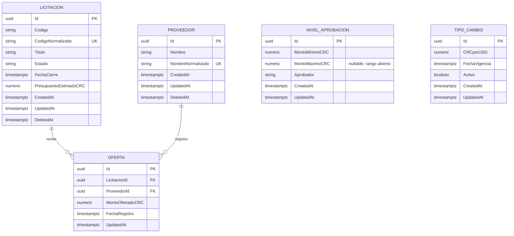

# Modelo de Datos

## Diagrama entidad-relación

`NivelAprobacion` y `TipoCambio` no tienen relación de clave foránea con el resto: se consultan por rango/monto y por bandera `Activo` respectivamente, no por asociación directa a una licitación u oferta específica.

## Convenciones aplicadas

- **Identificadores:** `uuid` generado en el dominio (`Guid.NewGuid()` en el constructor de fábrica de cada entidad), nunca editable ni generado por el cliente.
- **Montos:** `numeric(18,2)` para todo monto en colones (`PresupuestoEstimadoCRC`, `MontoOfertadoCRC`, `MontoMinimoCRC`, `MontoMaximoCRC`); `numeric(18,6)` para `CRCporUSD` por ser una tasa, no un monto. Nunca `float`/`double`.
- **Fechas:** `timestamp with time zone` (`DateTimeOffset` en C#); las comparaciones de negocio se hacen en UTC y la presentación usa la zona horaria `America/Costa_Rica`.
- **Auditoría:** `CreatedAt`/`UpdatedAt` en todas las entidades excepto `Oferta`, que usa `FechaRegistro` como equivalente de creación (spec §7). `DeletedAt` nullable en `Licitacion` y `Proveedor` para borrado lógico.
- **Concurrencia optimista:** todas las tablas usan la columna de sistema `xmin` de PostgreSQL como token de concurrencia (propiedad sombra `Version` mapeada en `Licitaciones.Infrastructure`, no un campo del dominio); ver [persistencia.md](Modulos/persistencia.md).
- **Índices únicos:**
  - `proveedores.NombreNormalizado`
  - `licitaciones.CodigoNormalizado`
  - `ofertas (LicitacionId, ProveedorId)` compuesto, para que un proveedor no pueda ofertar dos veces en la misma licitación
  - `tipos_cambio.Activo` parcial (`WHERE Activo = true`), de forma que solo un tipo de cambio esté activo a la vez
- **Claves foráneas:** `ofertas.LicitacionId` y `ofertas.ProveedorId` con `ON DELETE RESTRICT`. La integridad se protege con borrado lógico, no con cascada.

## Migraciones y semilla

La migración inicial (`InicialLicitaciones`) crea las cinco tablas anteriores. La semilla (`DatosSemilla` en `Licitaciones.Infrastructure`) aplica, vía `HasData`, los tres niveles de aprobación del enunciado (§8.7) y un tipo de cambio inicial activo, para que el sistema sea usable sin configuración manual. Detalle completo en [persistencia.md](Modulos/persistencia.md).
